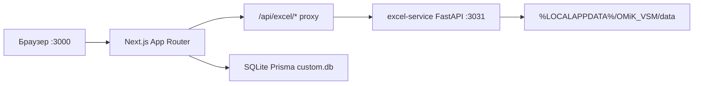
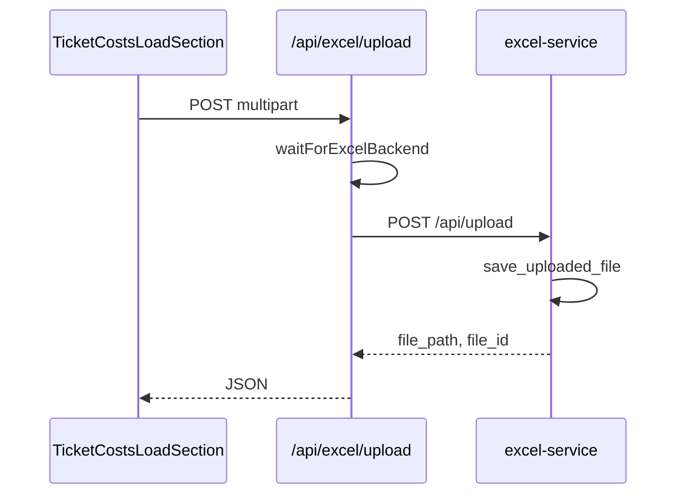

# Архитектура OMiK_VSM

## Компоненты

## Поток загрузки файла

## Пути API

Константы: `src/lib/api-paths.ts`  
Типы запросов: `src/types/excel-service-schemas.ts` (из `schemas.py`)

## Запуск

См. [LAUNCH.md](../LAUNCH.md) — единственный рекомендуемый способ для Windows.
